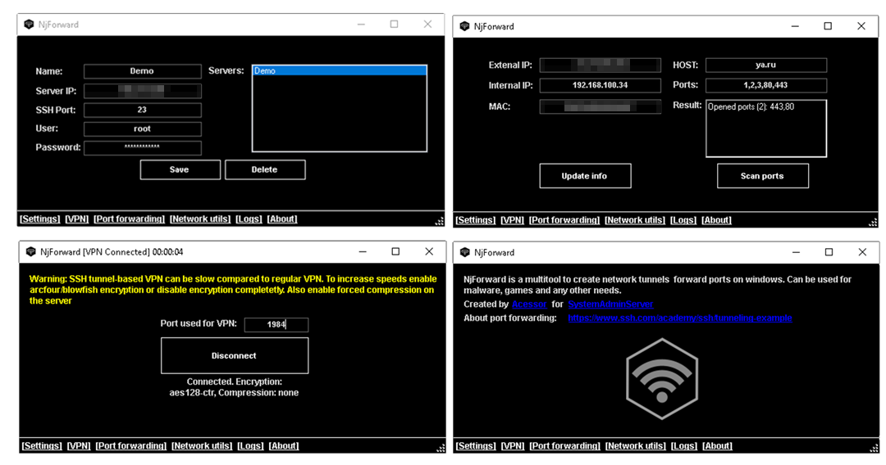

# NjForward

<div align=center style="background-color: transparent;">
	
</div>

NjForward is a windows software implementing easy SSY port forwarding, private VPN and other network-related utilities (Completely free & opensource). It's design is styled on purpose to resemble classic <a href="https://en.wikipedia.org/wiki/NjRAT">NJRAT 0.7D</a>. This tool can be used for offensive security purposes or any other needs, such as forwarding ports for playing multiplayer games or sharing your projects.

# Features
- SSH port forwarding (TCP tunnels)
- TCP tunneling based VPN
- Get network info (your local & remote ip, mac)
- Basic async TCP port scanner

# Requirements

- Windows 7+
- Dotnet 4.6.2+

# Usage guide
To use this tool you need to rent a linux dedicated server. I recommend using debian-based ones. The server doesn't need to be performant, since it will only act as a tunnel. All you need is to enable tunneling in your SSH config.

```bash
nano /etc/ssh/sshd_config
```

These options should be uncommented and set to the following values:

```
AllowTcpForwarding yes
GatewayPorts yes
```

Then restart sshd and you're done!

```bash
systemctl restart sshd
```

Add the server credentials to NjForward and you can use all the features, forward ports, etc.